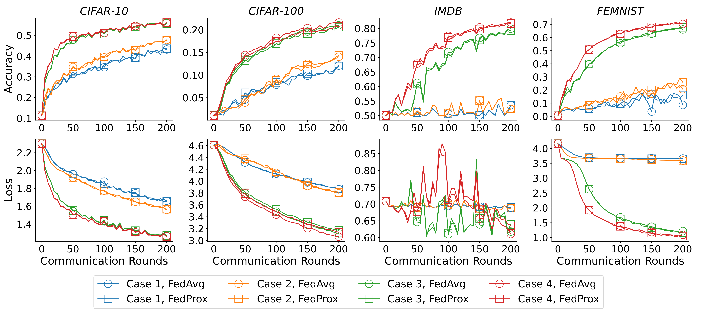

# Potential-Game Incentives for Federated Learning

This repository accompanies the paper [*Nonlinear Equilibrium Transitions in a Potential Game Model for Federated Learning*](https://arxiv.org/abs/2411.11793).
It implements a market-oriented federated-learning model in which clients choose their own local training effort in 
response to a server-provided reward. The client effort profile is computed as a Nash equilibrium of a potential game 
and is then used to determine the local work performed during federated training.

## Motivation

Conventional federated learning usually assumes that a server prescribes how much local training every client must 
perform. In practice, clients have different data, computational resources, and private participation costs. A fixed 
workload may encourage inefficient participation, strategic under-training, or dropout.

This work models clients as rational participants who balance a server reward against their individual training costs. 
Because a client’s reward depends on collective effort, their decisions are coupled. The key questions are how equilibrium 
effort changes with the server’s reward factor and whether that factor can improve the final federated model.

## Approach implemented

The server reward is designed so that the effort-selection problem forms a weighted potential game. This allows Nash 
equilibria to be studied through a single potential function and computed with a best-response algorithm.

For stationary effort choices with quadratic client costs, the paper identifies a nonlinear threshold structure in the 
reward factor. At a critical reward, the potential loses strict curvature, equilibrium may become non-unique, and the 
average client effort jumps from a low-effort to a high-effort branch. The method also identifies activation and saturation 
thresholds around this transition.

The implementation first solves the potential game for the critical reward regimes and saves the resulting 
rational-effort profiles. It then runs federated training with those profiles as client-local update budgets. 



## Repository contents

| File or directory | Purpose |
| --- | --- |
| `main_game.py` | Solves the potential game with the best-response algorithm, identifies critical reward cases, and saves equilibrium profiles. |
| `main_train.py` | Runs federated training using a precomputed equilibrium effort profile. |
| `utils/config_game.yaml` | Default potential-game configuration: client population, reward sweep, effort constraints, and best-response stopping criteria. |
| `utils/config_train.yaml` | Default federated-training configuration. |
| `utils/cases_m1000/`, `utils/cases_m3000/` | Pre-generated equilibrium case configurations for 1,000 and 3,000 clients. |
| `fed_game/game.py` | Potential-game model and best-response equilibrium computation. |
| `fed_game/client.py`, `fed_game/server.py`, `fed_game/federate.py` | Client updates, server aggregation, and federated-training orchestration. |
| `fed_game/dataset.py`, `fed_game/net.py` | Dataset preparation and model definitions. |

## Requirements

Use Python 3.10 or newer. Install the repository requirements and the training dependencies:

```bash
pip install -r requirements.txt
pip install torch torchvision datasets transformers pillow rich
```

The default configuration uses `device: mps`. Change `device` in `utils/config_train.yaml` to `cpu`, `cuda`, or another 
supported PyTorch device for the local system.

## Running the simulations

Run the commands from this directory. First compute the Nash-equilibrium effort profiles for the desired client population:

```bash
python main_game.py --m 1000
```

This saves four reward-regime case files under `utils/cases_m1000/`. Then choose one case and run federated training:

```bash
python main_train.py --m 1000 --case 1
```

Repeat the second command with `--case 2`, `--case 3`, or `--case 4` to study the remaining reward regimes. The default training 
configuration uses CIFAR-10, 1000 clients, and a CNN. Edit `utils/config_train.yaml` or pass supported command-line options 
to select another dataset, model, algorithm (`fedavg`, `fedprox`, or `moon`), device, or runtime budget. Datasets are 
downloaded automatically by the corresponding loader when required. Results, logs, and plots are saved in the run directory.

## Reference

K. Liu, Z. Wang, and E. Zuazua (2026). *Nonlinear Equilibrium Transitions in a Potential Game Model for Federated Learning*. 
Physica D: Nonlinear Phenomena, 135288. [arXiv:2411.11793](https://arxiv.org/abs/2411.11793). 

## Funding

This work was partially supported by the European Research Council (ERC) under the European Union's Horizon 2030 research
and innovation programme (grant agreement No. 101096251, CoDeFeL).
